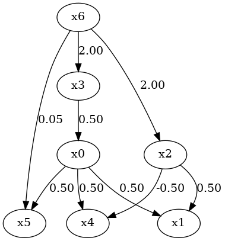

# Sample code for causal discovery by Lingam

Sample code that seeks to discover underlying causality by Lingam from table data (consisting solely of continuous variables) generated by the following DAG with unobservable `x6`.

## Summary

- `lingam.BottomUpParceLiNGAM` is sensitive to violating its assumption that there is no hidden variable that affects a non-exogenous variable.
- in this case, `lingam.RCD` (repetitive causal discovery) could properly identify the true DAG.
  - whether it works depends on the distribution of both error terms and hidden variable(s) as well as on their variances.
  - in particular, a gaussian error term makes it difficult for `lingam.RCD` to uncover causality.

## Contents

- scr/
  - `run_models.py` contains functions that load dataset, estimate causality, save resulting DAG as png.
  - `fns.py` contains supplementary functions for it.
- graph/
  - `pairplot_**.png` is a pairplot for the dataset whose error terms follow `**` distribution.
  - `rcd_est_(distribution).png` is the graphical counterpart of the estimated adjacency matrix given by `model.fit`.
  - `rcd_est_(distribution)_dag(ranking)_freq=(frequency).png` is one of DAGs estimated by the result of `model.bootstrap`.

## Environment

- Windows 10 (or 11) + WSL2 + Ubuntu 20.04
  - python 3.10.7 (pyenv 2.3.2) + poetry (1.1.11)
- Ubuntu 22.04
  - python 3.11.0 (pyenv 2.3.7) + poetry (1.2.2)

Follow a typical routine to set up a virtual environment by pyenv + poetry.
